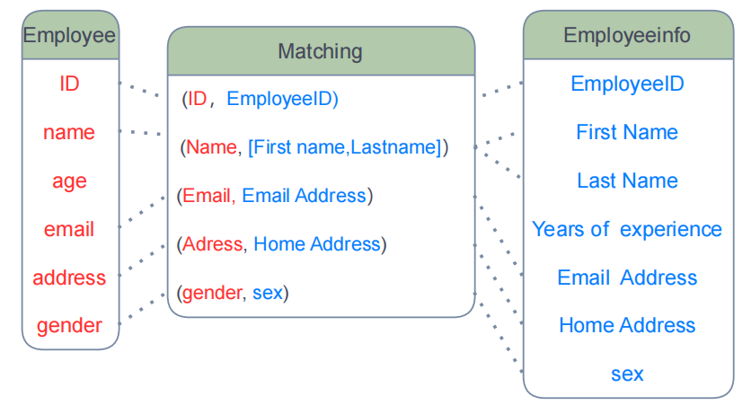
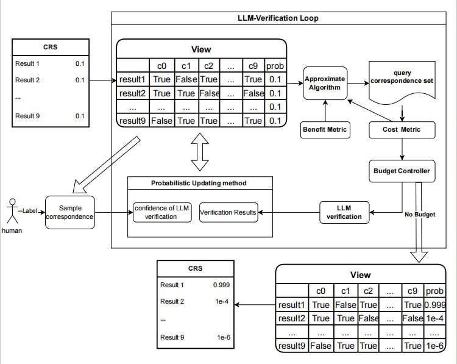

# prompt-matcher-for-schema-matching
This is a project for schema match based on prompt of GPT-4 or LLMs,  We get two SOTA results on two bench marks of schema matches. 

    

## 目录(Directory)
1. [介绍(introduce)](#介绍(introduce))
2. [功能特点(function features)](#功能特点(function_features)) 
3. [安装(installation)](#安装(installation)) 
4. [使用(usage)](#使用(usage)) 
5. [贡献联系方式(contact)](#联系方式(contact))         
6. [许可证(license)](#许可证(license))

## 介绍(introduce)

#### This is the experiment code project of paper “Cost-Aware Uncertainty Reduction in Schema Matching with GPT-4: The Prompt-Matcher Framework”
#### Prompt-matcher is a latest idea introducing GPT-4 with prompt for schema matching and we also design a effective and time-efficient approximate algorithm in the context of budget constraint.
#### Prompt-matcher is easy to use without training on labeled data and too many parameters to try.
#### users only need to evaluation an accuracy rate of the LLM, this process may only cost 5 minutes. After that prompt-matcher can run automatically in the whole process
#### To some extent, Prompt-Matcher integrate all the current possible schema match tools results and help users to select the most effective one.

    

## 功能特点(function_features)

This is the code project with python3，numpy.

1. Using LLM with prompt to do zero-shot learning. Two effective prompt for GPT-4 which can work on most of datasets.

2. effective solution on limited budget

## 安装(installation)

1. git clone <repo_name>
2. install the package of pip: pip install valentine, pandas, tiktoken, matplotlib,  scikit-optimize

中文:
1. git clone <this project> to local
2. install the pip packages:
pip install valentine, pandas, tiktoken, matplotlib,  scikit-optimize

## 使用(uasge)
1. run process.ipynb, it will generate the candidate result set at "./CRS"
2. fact.py is the data class define which save the crs, its probabilities and some operation functions
3. query.py there are four selection method for correspondence, which is used for our experiments.
4. improve_tool.py is the script where we define some tool functions.
5. main.py is the main entrance of our experiments.
6. prompt_test.ipynb is our notebook for testing the acc of AbbreviationMatch Prompt and Semantic Prompt with GPT-4 
7. before experiment, you should download the dataset as following: 
    
    7.1: "./data" to store the results: https://github.com/delftdata/valentine-paper-results.git  
    
    7.2: "DeepMdatasets and Fabricated dataset", https://surfdrive.surf.nl/files/index.php/s/QU5oxyNMuVguEku
    
    7.3: download the data from https://github.com/ruc-datalab/Unicorn.git to test prompt
    
## 联系方式(contact)
Email: fly_fenglongyu@outlook.com

## 许可证(license)
MIT license